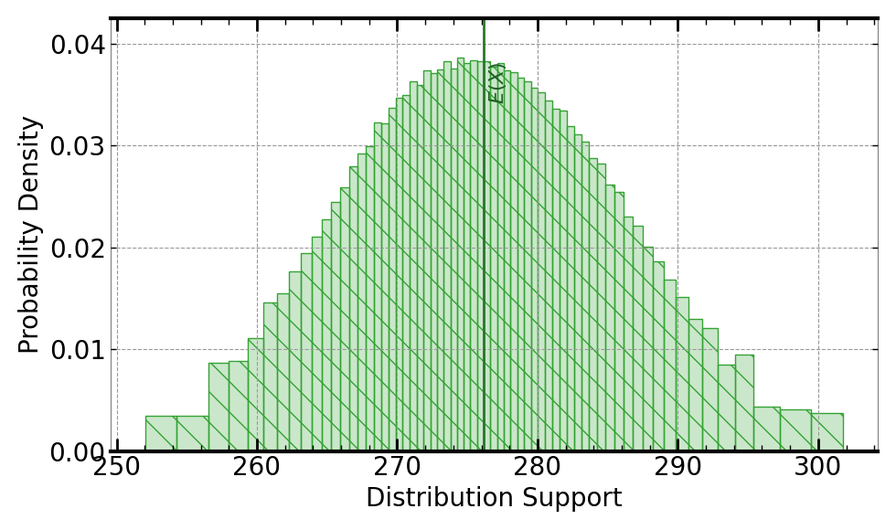

[](https://signaloid.io/repositories?connect=https://github.com/signaloid/Signaloid-Demo-Sensors-FLIRtemperatureConversionRoutines#gh-dark-mode-only)
[](https://signaloid.io/repositories?connect=https://github.com/signaloid/Signaloid-Demo-Sensors-FLIRtemperatureConversionRoutines#gh-light-mode-only)

# FLIR Ax5 Thermal Camera Use Case
Example demonstrating real-time output uncertainty estimation for calibrated ADC values from the an FLIR Ax5 thermal camera[^1].

## Cloning the Repository 
The correct way to clone this repository is:
```
git clone --recursive https://github.com/signaloid/Signaloid-Demo-Sensors-FLIRtemperatureConversionRoutines.git
```
To update all submodules
```
git pull --recurse-submodules
git submodule update --remote --recursive
```
If you forgot to clone with `--recursive`, and end up with empty submodule directories, you can remedy this with
```
git submodule update --init --recursive
```

## Introduction
Thermal cameras such as microbolometer arrays measure emitted electromagnetic
radiation and convert this to temperature based on a combination of the
underlying physical principles and calibration parameters for a particular
camera. Many thermal imaging cameras perform this conversion internally,
without enabling end-users of the equipment to estimate how uncertainty in
the calibration parameters or in the raw radiometric measurements lead to
uncertainty in the measured temperature. The thermal camera manufacturer
FLIR provides public documentation of the mathematical operations they
perform on the raw radiometric data to convert them to temperatures;
their cameras also provide access to the raw radiometric data as well as the
necessary complementary calibration parameters. This example implements the
radiometric-to-temperature conversion as detailed by FLIR, using calibration
parameters for an FLIR Ax5 camera.

The example uses the implied uncertainty given by the number of significant
digits in the calibration values provided by FLIR to set the default calibration
parameter uncertainty. The example defines these ranges in `utilities-config.h`(src/utilities-config.h).

The original Python code from [FLIR](https://flir.custhelp.com/app/answers/detail/a_id/3321/~/flir-cameras---temperature-measurement-formula):
```python
        #%% import libraries
        import numpy as np

        #%% object parameters

        # reflected energy
        Emiss = 1.0
        distance = 0.0
        TRefl = 21.85

        # atmospheric attenuation
        TAtmC = 21.85
        TAtm = TAtmC + 273.15
        Humidity = 0.0/100
        Tau = 1.0

        # external optics
        TExtOptics = 20
        TransmissionExtOptics = 1.0

        #%% camera calibration parameters
        # these depend on indivudal cameras and temperature range cases
        # examples used below are for an Ax5 camera

        R = 16556
        B = 1428.0
        F = 1.0
        J1 = 22.5916
        J0 = 89.796

        #%% function

        def counts2temp(data_counts:np.Array):       
        K1 = 1 / (Tau * Emiss * TransmissionExtOptics)
                
        # Pseudo radiance of the reflected environment
        r1 = ((1-Emiss)/Emiss) * (R/(np.exp(B/TRefl)-F))
        # Pseudo radiance of the atmosphere
        r2 = ((1 - Tau)/(Emiss * Tau)) * (R/(np.exp(B/TAtm)-F)) 
        # Pseudo radiance of the external optics
        r3 = ((1-TransmissionExtOptics) / (Emiss * Tau * TransmissionExtOptics)) * (R/(np.exp(B/TExtOptics)-F))
                
        K2 = r1 + r2 + r3
        
        data_obj_signal = (data_counts - J0)/J1
        data_temp = (B / np.log(R/((K1 * data_obj_signal) - K2) + F)) -273.15
        
        return data_temp
```

## Running the application locally
Apart from using Signaloid's Cloud Compute Platform, you can compile and run this application
locally. Local execution is essentially a native Monte Carlo implementation,
that uses GNU Scientific Library (GSL)[^2] to generate samples for the different input distributions.
In this mode the application stores the generated output samples, in a file called `data.out`.
The first line of `data.out` contains the execution time of the Monte Carlo implementation
in microseconds (μs), and each
next line contains a floating-point value corresponding to an output sample value.
Please note, that for the Monte Carlo output mode, you need to select a single output
to calculate, using (`-S`) command-line option.

In order to compile and run this application in the native Monte Carlo mode:

0. Install dependencies (e.g., on Linux):
```
sudo apt-get install libgsl-dev libgslcblas0
```
1. Compile natively (e.g., on Linux):
```
cd src/
gcc -O3 -I. -I/opt/local/include main.c utilities.c common.c uxhw.c -L/opt/local/lib -o native-exe -lgsl -lgslcblas -lm
```
2. Run the application in the MonteCarlo mode, using (`-M`) command-line option:
```
./native-exe -M 10000
```
The above program runs 10000 Monte Carlo iterations.

3. See the output samples generated by the local Monte Carlo execution:
```
cat data.out
```

## Inputs
You can modify the value of the distribution used for the sensor measurement,
using the `-sp` command line option. The default value used is a
(`UniformDist(30000, 30100)`).
Uncertainty is also inserted, by default, for the sensor calibration parameters of the Ax5 camera, the external optics parameters, in the atmosperic atenuation and in the reflected energy.
All values for the uncertain and non-uncertain parameters are defined in `utilities-config.h`(src/utilities-config.h).


## Outputs
The output is the value corresponding to the `data_temp` variable in the
reference Python code above.

Following is an example output, using Signaloid's C0Pro-S core:




## Usage
```
FLIR microbolometer array radiometric to temperature conversion routines.
Usage: Valid command-line arguments are:
        [-o, --output <Path to output CSV file : str>] (Specify the output file.)
        [-S, --select-output <output : int>] (Compute 0-indexed output, by default 0.)
        [-M, --multiple-executions <Number of executions : int (Default: 1)>] (Repeated execute kernel for benchmarking.)
        [-T, --time] (Timing mode: Times and prints the timing of the kernel execution.)
        [-b, --benchmarking] (Benchmarking mode: Generate outputs in format for benchmarking.)
        [-j, --json] (Print output in JSON format.)
        [-h, --help] (Display this help message.)
        [-sp, --sensor-parameter <particle value used to override default distribution for `counts`: double>]
```


---

[^1]: [FLIR Cameras — Temperature Measurement Formula](https://flir.custhelp.com/app/answers/detail/a_id/3321/~/flir-cameras---temperature-measurement-formula).

[^2]: [GNU Scientific Library](https://www.gnu.org/software/gsl/).

